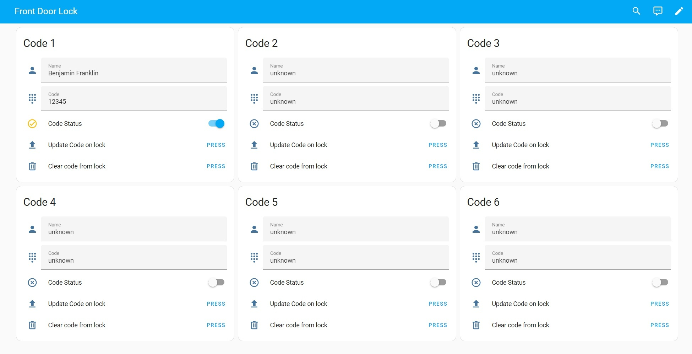

# Home Assistant integration to Manage Codes on Zigbee Keypad Locks
[![GitHub Release][releases-shield]][releases]
[![hacs][hacsbadge]][hacs]

This integration provides the YAML for a dashboard to manage lock codes on Zigbee keypad locks, and creates the helpers and automations behind the UI. 

## Features
* Generates helers and dashboard cards for each code slot
* Disable/Enable code slot
* Update code on lock
* Clear code from lock

## Installation

The easiest way to install is through HACS. This integration is already included in the HACS default repositories.

1. In Home Assistant, select HACS -> Integrations -> + Explore and Download Repositories. Search for Zigbee Lock Manager in the list and add it.
2. Restart Home Assistant
3. Set up and configure the integration: 

## Manual Installation

Copy the `custom_components/zigbee_lock_manager` directory to your `custom_components` folder. Restart Home Assistant, and add the integration from the integrations page.

This installation creates helpers from YAML templates stored in /config/packages/zigbee_lock_manager.  You must have the following in your configuration in order for this to work. 

homeassistant:
  packages: !include_dir_named packages

## Configuration

At this time the integration is only designed to manage the codes for a single lock.  To manage codes for multiple ZHA locks, you can create multiple instances of this integration, but they'll each have their own respsective input helpers. 

*While your lock may support 100 or more lock codes, it is recommended to choose 12-24 slots for optimal UI appearance and performance. The generated YAML was designed for Masonry layouts, and three cards fit nicely to a row.  For your dashboard OCD, choose a number of slots divisible by three. 

Slots: `# of code slots you want to manage`  
Lock: `entity_id of your ZHA keypad lock`

While not require, after install it's a good practice to reload YAML (Developer Tools > YAML > "ALL YAML CONFIGURATION") to ensure all changes are picked up and will be actionable. 

## Dashboard creation
Copy the YAML from:  
config/packages/zigbee_lock_manager/zigbee_lock_manager_dashboard   
Create a new dashboard, edit the raw config (three dots after enabling edit), and paste in the YAML from your clipboard.
Done.

[hacs]: https://hacs.xyz
[hacsbadge]: https://img.shields.io/badge/HACS-Default-41BDF5.svg?style=for-the-badge
[releases-shield]: https://img.shields.io/github/v/release/Fiercefish1/zigbee-lock-manager.svg?style=for-the-badge
[releases]: https://github.com/Fiercefish1/Zigbee-Lock-Manager/releases
